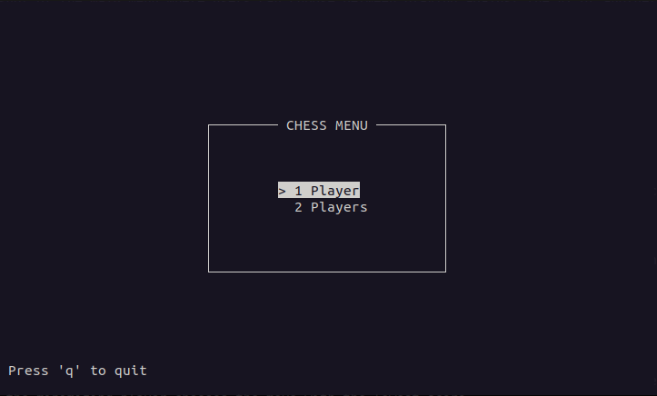
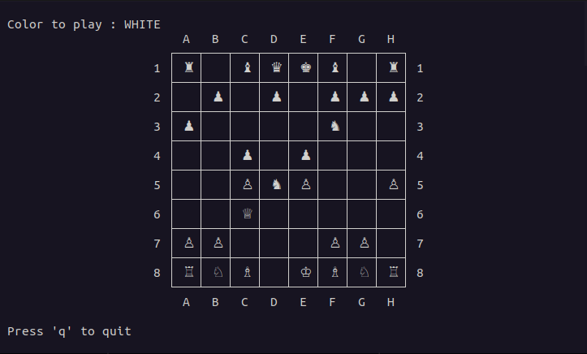

# CChess

Welcome to CChess, a simple chess game coded in C that allows you to play against an AI using the minmax algorithm or against another person on the same screen. The graphical interface is built using the ncurses library.

## Screenshots

1. **Main Menu:**
   - Here's the game's main menu, where you can choose between playing alone against the AI or with two players on the same screen.

   

2. **Gameplay:**
   - Once on the game screen, you can move the pieces by clicking on them with the mouse. If you're playing against the AI, it will automatically play after you.

   

## Minmax Algorithm in Chess

The AI opponent in this game utilizes the minmax algorithm to make decisions. The minmax algorithm is a decision-making algorithm used in two-player games, such as chess. Here's a brief explanation:

1. **Maximizing Player (AI):**
   - The AI is the maximizing player, trying to get the highest possible score. It assumes that the opponent will make the best moves to minimize the AI's score.

2. **Minimizing Player (Opponent/You):**
   - The opponent, or the human player, is the minimizing player, trying to get the lowest possible score. It assumes that the AI will make the best moves to maximize the opponent's score.

3. **Recursive Exploration:**
   - The algorithm recursively explores possible moves, creating a tree of possible game states. At each level, the maximizing player chooses the move with the highest score, and the minimizing player chooses the move with the lowest score.

4. **Heuristic Evaluation:**
   - The algorithm uses a heuristic evaluation function to assess the desirability of a particular board state. This function assigns a score based on factors like piece values, board control, and positional advantage.

## Cloning the Project

To clone the repository, use the following command:
```git clone https://github.com/Maclow42/CChess.git```

## Installing Dependencies {#installing-dependencies}

Before compiling the project, make sure you have the ncurses library installed on your system.

On Debian-based systems, you can install it with:
```sudo apt-get install libncurses5-dev libncursesw5-dev```

On Red Hat-based systems, use:
```sudo yum install ncurses-devel```

On Manjaro-based systems, use:
```pamac install ncurses```

## Compilation

To Navigate, compile and execute the game, use the following command:
```cd CChess && make && make run```

## Credits

Thanks to @TJ Holowaychuk <tj@vision-media.ca> for his doubly linked list implementation. Here's the link to the [github source directory](https://github.com/clibs/list).

## License
(MIT License)

Copyright (c) 2023 Maclow42 <maclow.cartier@hotmail.com>

Permission is hereby granted, free of charge, to any person obtaining a copy
of this software and associated documentation files (the "Software"), to deal
in the Software without restriction, including without limitation the rights
to use, copy, modify, merge, publish, distribute, sublicense, and/or sell
copies of the Software, and to permit persons to whom the Software is
furnished to do so, subject to the following conditions:

The above copyright notice and this permission notice shall be included in all
copies or substantial portions of the Software.

THE SOFTWARE IS PROVIDED "AS IS", WITHOUT WARRANTY OF ANY KIND, EXPRESS OR
IMPLIED, INCLUDING BUT NOT LIMITED TO THE WARRANTIES OF MERCHANTABILITY,
FITNESS FOR A PARTICULAR PURPOSE AND NONINFRINGEMENT. IN NO EVENT SHALL THE
AUTHORS OR COPYRIGHT HOLDERS BE LIABLE FOR ANY CLAIM, DAMAGES OR OTHER
LIABILITY, WHETHER IN AN ACTION OF CONTRACT, TORT OR OTHERWISE, ARISING FROM,
OUT OF OR IN CONNECTION WITH THE SOFTWARE OR THE USE OR OTHER DEALINGS IN THE
SOFTWARE.